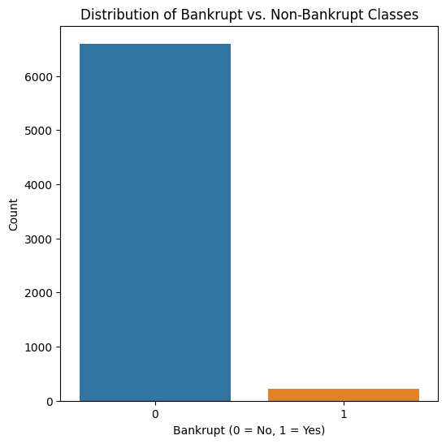
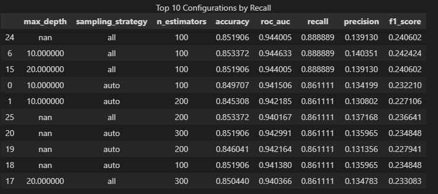
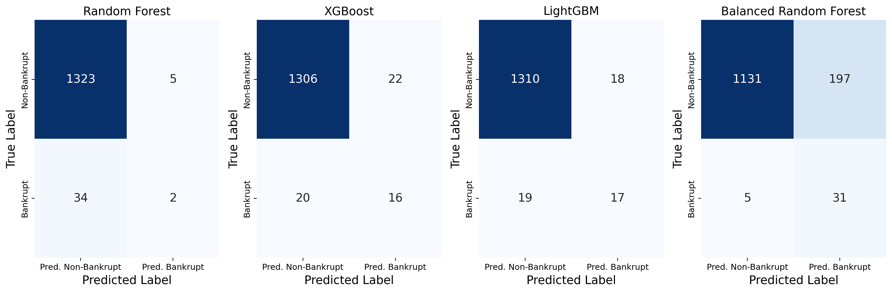
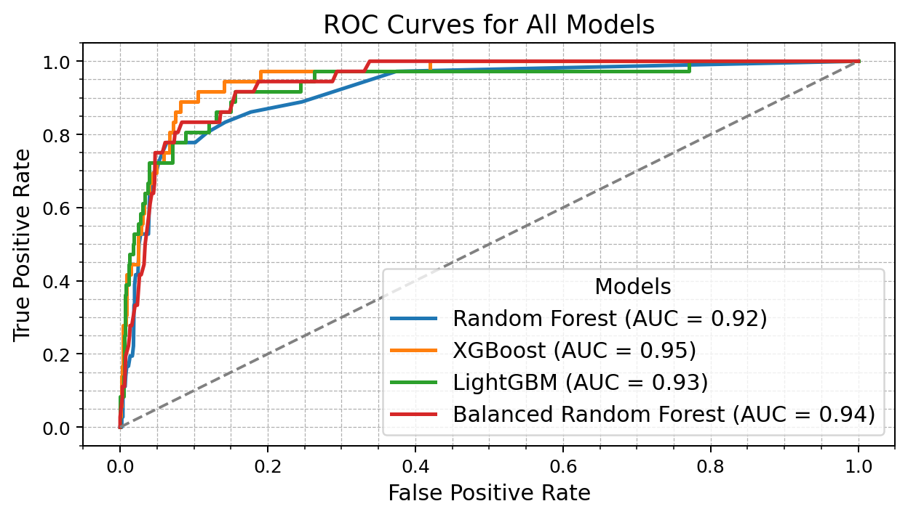
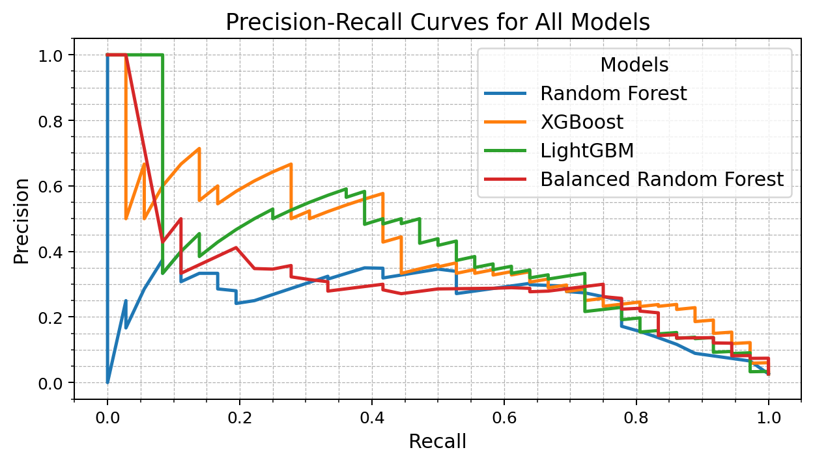
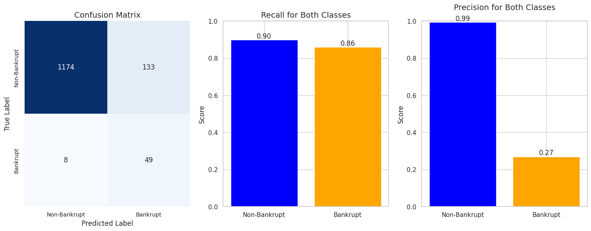
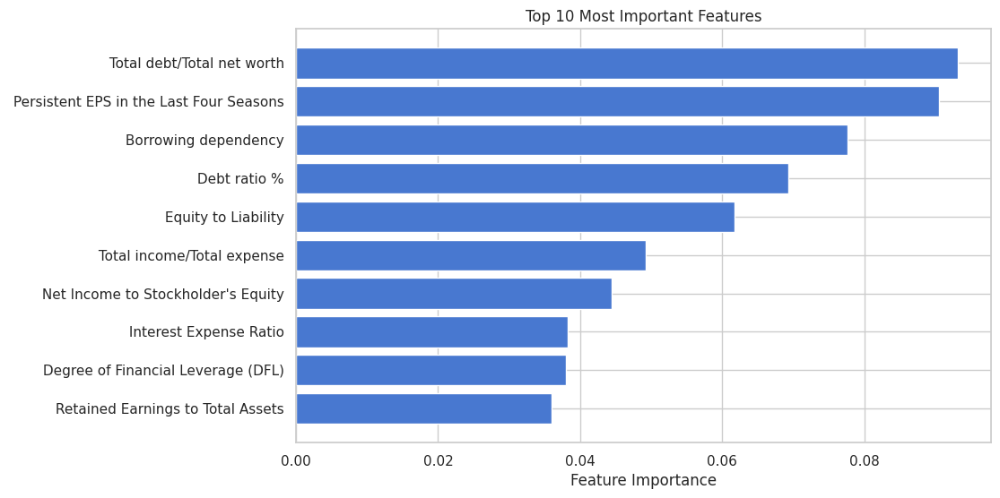
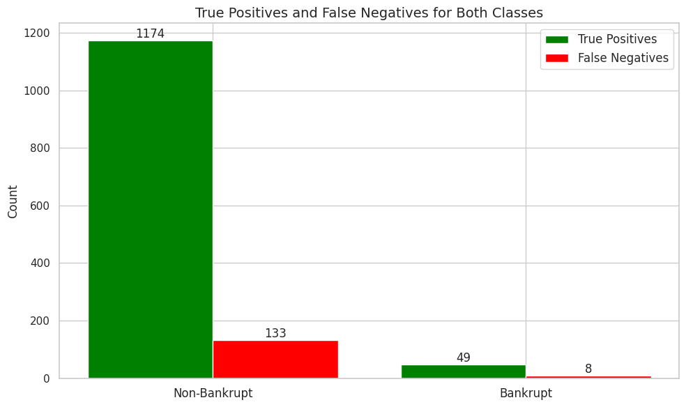

# Bankruptcy Prediction using Machine Learning

A machine learning project for predicting corporate bankruptcy based on financial indicators.

---

## Introduction

Predicting company bankruptcy is a high-stakes financial task with implications for investors, creditors, and regulatory bodies. Early detection of financial distress can help mitigate economic fallout. This project aims to build predictive models that classify whether a company is at risk of bankruptcy using financial statement data.

---

# Data & Preprocessing

## Project Overview

- **Prediction Target:** Binary classification – Bankrupt vs. Non-Bankrupt.
- **Scope:** Publicly listed companies in Taiwan from 1999 to 2009.
- **Environment:** Local Jupyter notebooks using pandas, NumPy, scikit-learn, and TensorFlow.

## Data Sources

### Source: Taiwan Economic Journal (TEJ)
- Covers 6,819 companies over 10 years.
- 95 original financial features (ratios and indicators).
- Excludes financial sector firms to avoid structural bias.

## Preprocessing Pipeline

### Stage 1: Ingest
- Adjusted feature scales via standardization (z-score) using training set stats.
- Filtered correlated features (Pearson r > 0.9), reducing to 76 features.

### Stage 2: Modeling Prep
- Labels constructed as binary indicators of bankruptcy.
- Dataset split: 60% train, 20% validation, 20% test (stratified).
- Standardization applied using training data mean and std to prevent leakage.

## Feature Engineering

### Target Variable
- Binary target: 1 = Bankrupt, 0 = Non-bankrupt (defined per TEJ rules).

### Core Features
- Numerical: Liquidity ratios, profitability ratios, leverage indicators.
- Key examples: Total Debt/Net Worth, Persistent EPS, Borrowing Dependency.

### Feature Selection
- Removed 19 highly correlated features.
- Final model trained on 76 features.

## Data Dictionary
## Data Dictionary (Selected Financial Features)

### Profitability
- `ROA(C) before interest and depreciation before interest` — *[ratio or %]* — Return on assets before interest & depreciation.
- `ROA(A) before interest and % after tax` — *[ratio or %]* — Return on assets pre-interest, post-tax.
- `ROA(B) before interest and depreciation after tax` — *[ratio or %]* — ROA pre-interest & depreciation, post-tax.
- `Operating Gross Margin` — *[%]* — Gross profit / revenue.
- `Realized Sales Gross Margin` — *[%]* — Realized gross profit / realized sales.
- `Operating Profit Rate` — *[%]* — Operating income / revenue.
- `Pre-tax net Interest Rate` — *[%]* — Net interest / revenue (pre-tax).
- `After-tax net Interest Rate` — *[%]* — Net interest / revenue (post-tax).
- `Non-industry income and expenditure/revenue` — *[ratio]* — Non-operating net income / revenue.
- `Continuous interest rate (after tax)` — *[%]* — Sustained interest expense / revenue (post-tax).
- `Operating Expense Rate` — *[%]* — Operating expenses / revenue.
- `Research and development expense rate` — *[%]* — R&D expenses / revenue.
- `Cash flow rate` — *[ratio or %]* — Cash flow / revenue.
- `Interest-bearing debt interest rate` — *[%]* — Interest expense / interest-bearing debt.

### Liquidity & Solvency
- `Current Ratio` — *[times]* — Current assets / current liabilities.
- `Quick Ratio` — *[times]* — (Cash + equivalents + receivables) / current liabilities.
- `Debt ratio %` — *[%]* — Total liabilities / total assets.
- `Net worth/Assets` — *[ratio]* — Equity / total assets.
- `Total debt/Total net worth` — *[ratio]* — Total debt / equity.
- `Borrowing dependency` — *[ratio]* — Interest-bearing debt / total assets (or funding share).
- `Working Capital to Total Assets` — *[ratio]* — (Current assets − current liabilities) / total assets.
- `Quick Assets/Total Assets` — *[ratio]* — Quick assets / total assets.
- `Cash/Total Assets` — *[ratio]* — Cash & equivalents / total assets.
- `Current Liability to Assets` — *[ratio]* — Current liabilities / total assets.
- `Current Liabilities/Equity` — *[ratio]* — Current liabilities / equity.
- `Long-term Liability to Current Assets` — *[ratio]* — Long-term liabilities / current assets.
- `Retained Earnings to Total Assets` — *[ratio]* — Retained earnings / total assets.
- `Equity to Liability` — *[ratio]* — Equity / total liabilities.
- `Liability to Equity` — *[ratio]* — Total liabilities / equity.

### Efficiency (Activity)
- `Total Asset Turnover` — *[times/year]* — Revenue / total assets.
- `Accounts Receivable Turnover` — *[times/year]* — Credit sales / avg. A/R.
- `Average Collection Days` — *[days]* — 365 / A/R turnover.
- `Inventory Turnover Rate (times)` — *[times/year]* — COGS / avg. inventory.
- `Fixed Assets Turnover Frequency` — *[times/year]* — Revenue / net fixed assets.
- `Net Worth Turnover Rate (times)` — *[times/year]* — Revenue / equity.
- `Current Asset Turnover Rate` — *[times/year]* — Revenue / current assets.
- `Quick Asset Turnover Rate` — *[times/year]* — Revenue / quick assets.
- `Working capitcal Turnover Rate` — *[times/year]* — Revenue / working capital.
- `Cash Turnover Rate` — *[times/year]* — Revenue / cash & equivalents.

### Cash Flow & Coverage
- `Cash Flow to Sales` — *[ratio]* — Operating cash flow / revenue.
- `Cash Flow to Total Assets` — *[ratio]* — Operating cash flow / total assets.
- `Cash Flow to Liability` — *[ratio]* — Operating cash flow / total liabilities.
- `Cash Flow to Equity` — *[ratio]* — Operating cash flow / equity.
- `CFO to Assets` — *[ratio]* — Cash flow from operations / total assets.
- `Interest Coverage Ratio (Interest expense to EBIT)` — *[times]* — EBIT / interest expense.
- `Degree of Financial Leverage (DFL)` — *[times]* — % change in EPS / % change in EBIT (or model-specific).

### Growth & Returns
- `Realized Sales Gross Profit Growth Rate` — *[%/period]* — Δ gross profit / prior gross profit.
- `Operating Profit Growth Rate` — *[%/period]* — Δ operating profit / prior operating profit.
- `After-tax Net Profit Growth Rate` — *[%/period]* — Δ net income / prior net income.
- `Regular Net Profit Growth Rate` — *[%/period]* — Δ recurring net income / prior recurring net income.
- `Continuous Net Profit Growth Rate` — *[%/period]* — Smoothed net income growth rate.
- `Total Asset Growth Rate` — *[%/period]* — Δ total assets / prior total assets.
- `Net Value Growth Rate` — *[%/period]* — Δ equity / prior equity.
- `Total Asset Return Growth Rate Ratio` — *[ratio]* — Growth in ROA vs. asset growth.
- `Net Income to Total Assets` — *[ratio]* — Net income / total assets (ROA).
- `Gross Profit to Sales` — *[%]* — Gross profit margin.
- `Net Income to Stockholder's Equity` — *[ratio or %]* — Net income / equity (ROE).

### Structure & Other
- `Current Liabilities/Liability` — *[ratio]* — Current liabilities / total liabilities.
- `Current Liability to Current Assets` — *[ratio]* — Current liabilities / current assets.
- `Inventory/Working Capital` — *[ratio]* — Inventory / working capital.
- `Inventory/Current Liability` — *[ratio]* — Inventory / current liabilities.
- `Operating Funds to Liability` — *[ratio]* — Operating funds / total liabilities.
- `Contingent liabilities/Net worth` — *[ratio]* — Contingent liabilities / equity.
- `Long-term fund suitability ratio (A)` — *[ratio]* — (Equity + long-term debt) / fixed assets (proxy).
- `Liability-Assets Flag` — *[binary]* — Indicator for liabilities ≥ assets.
- `Net Income Flag` — *[binary]* — Indicator for positive net income.
---

# Architecture & Infrastructure

## System Overview
1. Data ingestion and cleaning.
2. Feature engineering and standardization.
3. Model training and evaluation.
4. Comparison of model performance and interpretability.

## Tools & Platforms
- **Processing:** pandas, NumPy.
- **Training:** scikit-learn, TensorFlow, LightGBM, XGBoost.
- **Environment:** Local CPU (Intel), Python 3.10, Jupyter Lab.

---

# Modeling

## Problem Framing

- **Type:** Binary classification.
- **Challenge:** Severe class imbalance (only 3.2% of companies are bankrupt).

## Models Considered

- Logistic Regression (baseline and neural)
- Random Forest
- XGBoost
- LightGBM
- Balanced Random Forest

## Training Details

- Batch size: 32 (for Keras models)
- Epochs: 20
- Optimizer: Adam (learning rate 0.01 for Keras)
- Class balancing: Class weighting, SMOTE, ADASYN

## Evaluation

### Metrics
- Focused on: Recall, Precision, F1-score (especially for minority class), ROC AUC.
- Accuracy alone is misleading due to imbalance.

### Hyperparameter Tuning

### Results

### Final Model Selection

- **Best Model:** Balanced Random Forest (after hyperparameter tuning)
  - Accuracy: 90%
  - Recall (Bankrupt): 86%
  - Precision (Bankrupt): 27%
  - ROC AUC: 0.94
  - F1-score (Bankrupt): 0.41

### Interpretability

- Top Features:
  - Total Debt/Net Worth
  - Persistent EPS (4 seasons)
  - Borrowing Dependency
  - Debt Ratio
  - Equity to Liability

### Error Analysis

- False Positives: Companies incorrectly flagged as bankrupt.
- False Negatives: 8 missed bankruptcies – small but critical.
- Misclassification costs discussed in conclusions.

---

# Conclusion & Future Work

This project showed that a Balanced Random Forest with tuned parameters could capture 86% of bankrupt companies while maintaining reasonable precision. Feature analysis revealed leverage and earnings stability as core bankruptcy drivers.

### Future Work:
- Test additional sampling methods (e.g., Tomek Links, SMOTE-ENN).
- Explore LSTM or Transformer-based models on financial time series.
- Incorporate macroeconomic indicators or textual sentiment data.

---

# Tools & Technologies

### Infrastructure
- Local environment (CPU-based).

### Data Processing
- pandas, NumPy

### Modeling
- scikit-learn, TensorFlow (Keras), LightGBM, XGBoost, imbalanced-learn

### Workflow & Automation
- Jupyter Notebooks, matplotlib, seaborn

### Visualization
- matplotlib, seaborn

### Collaboration & Version Control
- Git/GitHub

---

