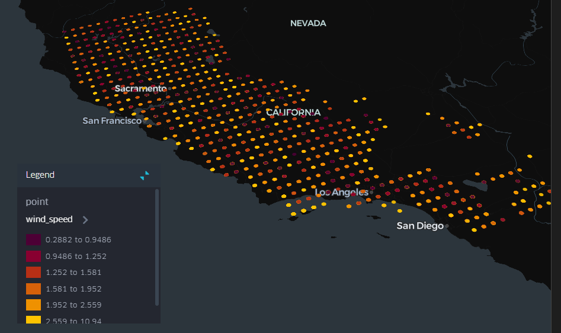
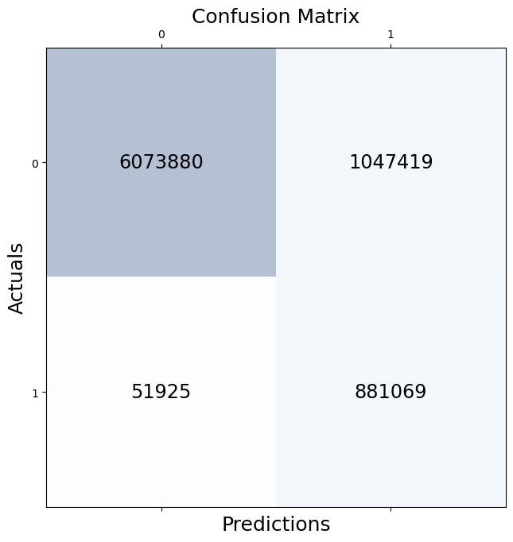
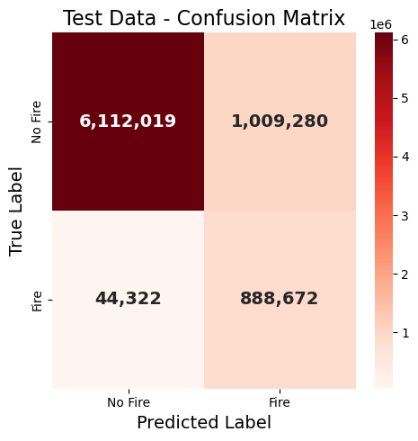
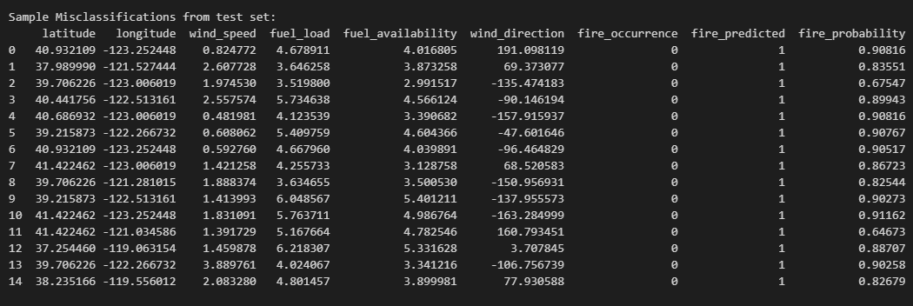
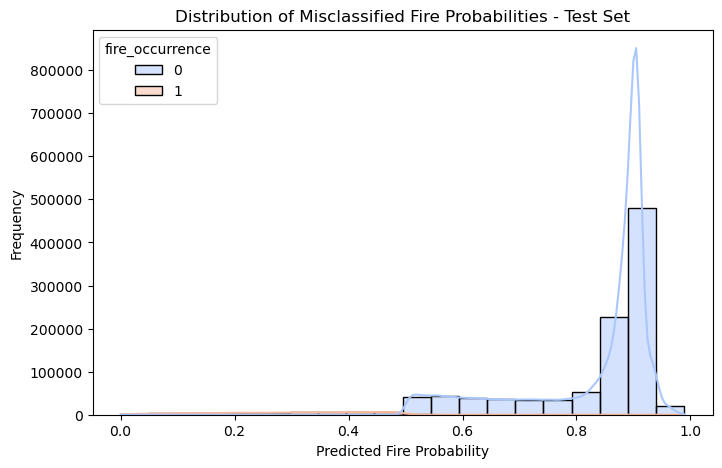
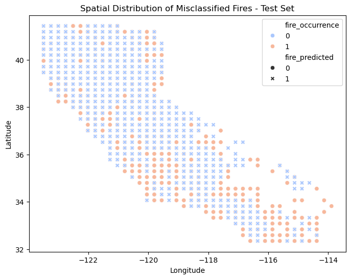

# FireGuard - Wildfire Ignition Prediction with Machine Learning

## Introduction
Introduction
Wildfires are becoming more frequent, severe, and unpredictable, fueled by climate change, prolonged droughts, and human expansion into fire-prone areas. Traditional management systems such as NASA’s FIRMS are highly effective at detecting active fires in real time, but they remain reactive—fires are only flagged after ignition. By that point, communities and ecosystems are already at risk, and managers have limited options for prevention.

This project, FireGuard, was developed as part of my capstone in collaboration with a team. Our motivation was simple: could we predict where the next wildfire is most likely to ignite before the first spark? To answer this, we combined NASA FIRMS fire detections with ERA5 reanalysis weather and environmental data to train machine learning models that forecast ignition risk.

The result is a prototype wildfire risk prediction system that generates daily ignition risk maps for California. Instead of asking “Where is fire burning now?” FireGuard shifts the focus to “Where might fire start next?” By achieving high recall with balanced precision, the models provide early warnings that prioritize prevention over reaction. While not perfect, the system demonstrates the potential for machine learning to support proactive wildfire management and resource allocation.

# FireGuard - Data & Preprocessing

## Project Overview
FireGuard predicts **where new wildfires are likely to ignite next** by learning from historical satellite detections and up‑to‑date environmental conditions. We integrated NASA FIRMS active‑fire detections with ERA5 reanalysis weather to produce an analysis‑ready dataset for modeling daily ignition risk at a 0.25° grid.

- **Study window:** 2013‑01‑01 → 2025‑01‑31  
- **Region (MVP):** California (selected for impact and data density)  
- **Storage:** AWS S3 (partitioned by year/region); daily append jobs  
- **Processing:** Ingest/merge pipeline + SageMaker modeling prep; orchestrated with AWS Lambda + Step Functions

> **Expert guidance applied:** We prioritized **VIIRS 375 m** detections and **did not mix** MODIS with VIIRS in a single training set; we favored **standard science‑quality** products when available, considered **burned‑area** layers for validation, and addressed class imbalance by broadening time/region rather than synthetic positives.

---

## Data Sources (Finalized)

### NASA FIRMS - Active Fire Detections
**Explored:**
- **VIIRS 375 m**: S‑NPP (2012+), NOAA‑20 (2017+), NOAA‑21 (2022+)
- **MODIS 1 km**: Terra/Aqua (2000+)

**Used for MVP training:**
- **VIIRS 375 m** only (S‑NPP/NOAA‑20/NOAA‑21) as the **primary label source**.  
- MODIS evaluated **separately** for robustness, not fused with VIIRS.

**Rationale:** VIIRS detects smaller/earlier thermal anomalies; mixing with MODIS introduces scale bias and non‑comparability.

### ERA5 - Environmental Predictors
ERA5 hourly/daily aggregates aligned to the 0.25° grid:  
- Wind components: `u10`, `v10` (→ speed & direction)  
- Temperature & humidity: `t2m`, `d2m`, `skt`  
- Moisture & precip: `swvl1`, `tcrw`, `evap`, `potential_evap` (where present)  
- Clouds/cover: `tcc`  
- Terrain/pressure: `z`, `sp`  
- Vegetation/fuels: `lai_lv`, `lai_hv`, `tvl`, `tvh`

> Pipeline designed to flexibly add **Fire Weather Index (FWI)** composites, lightning, and WUI proxies in future iterations.

---

## Two‑Stage Preprocessing Pipeline

### Stage 1: Ingest & Merge (Daily)
1. **Backfill + Daily Append**: Retrieve FIRMS and ERA5; write to S3 (year/region partitions).  
2. **Temporal Alignment**: Convert timestamps to **date** (daily risk cadence).  
3. **Spatial Quantization**: Snap lat/lon to **0.25°** (ERA5 grid).  
4. **Join Keys**: `(date, latitude, longitude)`; **outer merge** to preserve no‑fire contexts.  
5. **Normalization**: Fill missing values consistently (`daynight` → `'D'`, `confidence` → `'n'`, `brightness` → `0`).  
6. **Filtering**: California bounding box for MVP; store as yearly files (e.g., `2019_california_era5_firms_dataset.csv`).  
7. **Scaling**: Chunked processing (**1M‑row blocks**) for memory stability.

### Stage 2 - Modeling Prep (SageMaker)
1. **Type Cleaning & De‑duplication**.  
2. **Label Construction** (see below).  
3. **Drop Non‑Numeric Text Fields** (e.g., `confidence` letter codes).  
4. **Multicollinearity Pruning**: remove features with |ρ| > 0.95 within fold.  
5. **Standardization**: z‑score scaling for numeric features.  
6. **Stratified Split**: 80/10/10 train/val/test.  
7. **Persist Splits to S3** via chunked writes.

**Final split shapes:**  
- Train: **64,434,342 × 30**  
- Val: **8,054,293 × 30**  
- Test: **8,054,293 × 30**

---

## Feature Engineering

### Target (Ignition at Overpass)
- `fire_occurrence` ∈ {0,1}  
  - **1** if any FIRMS detection maps to that cell/date (post‑quantization),  
  - **0** otherwise.  
- Aligns with active‑fire semantics: fires at satellite overpass; omission managed by scale/time breadth rather than synthetic positives.

### Core Features (Kept for MVP)
- **Wind & Dynamics**: `u10`, `v10` → **speed** (√(u10²+v10²)) and **direction** (arctan2(v10,u10)).
- **Temperature & Dryness**: `t2m`, `d2m` (→ VPD proxy via spread), `skt`.
- **Moisture & Precip**: `swvl1`, `tcrw`, (`evap`, `potential_evap` when present), snow state (`sd`, `rsn`, `tsn`) seasonally.
- **Cloud/Radiation Proxy**: `tcc`.
- **Terrain/Pressure**: `z` (retained when not collinear), `sp`.
- **Vegetation/Fuels**: `lai_lv`, `lai_hv`, `tvl`, `tvh`.
- **Context & Seasonality**: quantized `latitude`, `longitude`, month/day‑of‑year; FIRMS `daynight` for overpass context.

### Feature Selection/Pruning
- Remove non‑numeric fields not modeled directly (e.g., `confidence` string codes).  
- Drop features exceeding correlation threshold (|ρ| > 0.95) within fold (e.g., `stl1`, occasionally `z`).  
- Standardize all numeric features; maintain feature name registry for consistent downstream use.

---

## Data Dictionary (Concise)

**Keys & Spatial/Temporal**  
- `date` - UTC date of record (daily).  
- `latitude`, `longitude` - quantized to **0.25°**.

**Label**  
- `fire_occurrence` - 1 if a FIRMS detection exists in cell/date, else 0.

**FIRMS Context**  
- `brightness` - thermal anomaly intensity (diagnostic).  
- `daynight` - overpass context (`'D'`/`'N'`).

**ERA5 Core**  
- `u10`, `v10` - 10 m wind components (m/s).  
- `t2m`, `d2m` - 2 m temp & dew point (K).  
- `skt` - skin temperature (K).  
- `swvl1` - top‑soil moisture (0–7 cm).  
- `tcc` - total cloud cover (0–1).  
- `tcrw` - total column rain water (kg/m²).  
- `sp` - surface pressure (Pa).  
- `z` - geopotential (m²/s²), terrain proxy.  
- `lai_lv`, `lai_hv` - leaf area index (low/high vegetation).  
- `tvl`, `tvh` - vegetation type codes.  
- **Derived:** wind speed/direction; seasonal encodings (month/DOY).

**Dropped (Examples)**  
- Non‑numeric codes: `confidence`, `confidence_x`.  
- >0.95‑correlated features (e.g., `stl1`, fold‑specific redundancies).  
- Experimental placeholders (e.g., `fuel_moisture`, `fire_risk`) when collinear.

---

## AWS Architecture (At‑a‑Glance)
1. **S3 (Raw/Curated)** - FIRMS/ERA5 backfill + daily appends; yearly California partitions.  
2. **Lambda** - triggers Stage‑2 preprocessing on new objects.  
3. **Step Functions** - orchestrates ingest → merge → preprocess → split → (optional) training.  
4. **SageMaker Processing/Training** - feature prep, scaling, split, and model runs.  
5. **S3 (Preprocessed/Models)** - versioned outputs for train/val/test and artifacts.

## Notebook & Training Instances  

- **Preprocessing & General Training:**  
  - Instance type: `ml.p4d.24xlarge`  
  - CPU/RAM: 96 vCPUs, 1.1 TB memory  
    - RAM Used: 1.81 GB (preprocessing), 28.01 GB (training)  
    - Available: 130.56 GB (preprocessing), 170.75 GB (training)  
  - GPU: 4× NVIDIA A10G (24 GB each, CUDA 12.4)  

- **LightGBM (JumpStart Baseline):**  
  - Inference instance type: `ml.m5.large`  
  - Endpoint: `my-lightgbm-endpoint-fireguard-5`  

- **TabNet (Balanced + Focal Models):**  
  - Training instance type: `ml.g4dn.8xlarge`  
  - GPU: NVIDIA T4 (16 GB VRAM)  
  - Framework: PyTorch 1.13.1 (GPU, Python 3.9)  
  - Batch size: 2,048  
  - Training/validation data: S3 bucket (`fireguarddata`)  
  - Output path: `s3://fireguarddata/models/tabnet/`  
  
These resources allowed us to preprocess large-scale FIRMS and ERA5 datasets in chunks (2M rows at a time) and train deep learning models like TabNet with large batch sizes (4k–16k) without memory bottlenecks.  

---

### Notes & Future Enhancements
- Add **FWI** composites, **lightning**, and **WUI** ignition pressure proxies.  
- Evaluate **burned‑area** products for backfilling omissions and post‑event validation.  
- Consider finer‑grid downscaling / spatial features (topography, aspect) where available.

---

# FireGuard Modeling

## Problem Framing
We formulate ignition prediction as a **binary classification** problem at the grid‑cell/day level: predict whether a new fire will be detected at the next satellite overpass given the concurrent environmental state. The strong class imbalance (≈ **11–14% positive** depending on brightness thresholds and day/night splits) motivated both **sampling** and **loss‑weighting** strategies.

### Label Refinement with Brightness Thresholds
In line with VIIRS documentation and the literature (e.g., Giglio et al.), we refined labels using brightness temperature thresholds that reflect operational algorithm design:
- **Night:** flag fire when I4 brightness **≥ 320 K** (quality flags nominal).
- **Day:** use a **context‑aware** rule inspired by the BT4s background window, constraining the local background to **325–330 K**; practically, we evaluated **≥ 325–330 K** to tighten the daytime definition.

> We re‑ran the preprocessing to apply these thresholds consistently prior to modeling, rather than filtering post‑hoc.

## Models Considered & Rationale
We compared **gradient‑boosted decision trees (LightGBM)** and a **neural architecture for tabular data (TabNet)**. The two paradigms complement each other:
- **LightGBM** is fast, handles large tabular datasets, monotonic trends, and heterogeneous features, and provides strong baselines with well‑understood feature importance.
- **TabNet** brings **sequential attention and sparse feature selection** directly on raw features, potentially capturing interactions that tree ensembles approximate with depth/ensembles. It remains **interpretable** via learned feature masks.

We retained both families: LightGBM as the **production‑grade baseline** (SageMaker JumpStart), and TabNet as an **attention‑based learner** with variants tailored to imbalance.

## Baseline: LightGBM (SageMaker JumpStart)
**Architecture.** Gradient‑boosted decision trees trained stage‑wise to minimize a differentiable loss; leaf‑wise growth with histogram‑based splits for speed; regularization via learning rate, feature/row subsampling, and tree constraints.

**Training stack.** Deployed through **SageMaker JumpStart** using the `lightgbm-classification-model` image/script URIs. We trained on the preprocessed splits in S3 and packaged the resulting model artifact for inference on an `ml.m5.large` endpoint. This served as the control against which TabNet variants were evaluated.

**Why LightGBM here?** It excels on high‑cardinality tabular problems, is robust to mixed‑scale inputs (after standardization), and offers transparent tuning (depth, leaves, learning rate) and calibrated probabilities (via validation‑based early stopping or post‑hoc calibration if needed).

## TabNet Family
**Architecture.** TabNet processes features through a sequence of **decision steps**. At each step, an **attentive transformer** computes sparse masks that select which features to read; a **feature transformer** then learns nonlinear combinations. This yields **sparse, interpretable** attention over features and step‑wise representations. We trained three TabNet variants:

1) **TabNet (vanilla)** - standard cross‑entropy, baseline hyperparameters; useful for establishing capacity without imbalance interventions.

2) **TabNet (balanced weights)** - uses **class‑weighted cross‑entropy** where minority fire events receive higher loss weight. We compute weights from training labels (inverse frequency) and pass a weighted loss to TabNet. This reduces bias toward the majority class and improves **recall/TPR** at comparable precision.

3) **TabNet (focal loss)** - employs **focal loss** (γ = 2.0) with **α** set from inverse class frequencies. Focal loss down‑weights easy negatives and focuses optimization on **hard, rare fire positives**, often improving minority detection under extreme imbalance.

**Why these three?** Vanilla tests capacity; **weighted CE** explicitly rebalances the objective; **focal** dynamically emphasizes difficult positives and ambiguous regions (e.g., warm/dry but non‑fire days), which is well‑suited to ignition rarity.

## Sampling Strategy for Class Imbalance
Alongside loss‑weighting, we applied sampling strategies to create informative training batches:
- **Temporal/Spatial Negative Sampling:** ensure negatives are drawn from the **same cells and seasons** as positives (avoid trivial separability).
- **Down‑sampling Majority Class:** moderate reduction of abundant non‑fire rows to stabilize batches without discarding critical context.
- **No synthetic positives:** per expert guidance, we expanded the **time horizon (2013–2025)** instead of generating synthetic fires.
- **Threshold tuning:** post‑training, we evaluate probability thresholds by **precision‑recall trade‑offs** (operational users can favor recall to minimize missed ignitions, or precision to reduce false deployments).

## Training Details (TabNet)
- **IO & scale:** CSVs streamed from S3 with **1M‑row chunks** to manage memory; floats cast to **float32**.
- **Optimization:** Adam/AdamW, batch sizes **4k–16k**, early stopping on **balanced accuracy**, and learning‑rate scheduling for stability.
- **Persistence:** models saved to `/opt/ml/model/*.pkl` per SageMaker convention for deployment.

## What Each Model Learns Well
- **LightGBM:** strong on monotonic effects (e.g., hotter/drier → higher risk), seasonality encodings, and mixed interactions; fast to iterate and calibrate.
- **TabNet:** can highlight **sparse, high‑signal subsets** (e.g., low humidity + strong winds + high LAI) and discover interactions less obvious to trees. Attention masks support interpretability at **step** and **feature** levels.

> The EDA plots (correlations, monthly/seasonal patterns, day/night skew, label imbalance) guided the choice to combine **weighted objectives** with **calibrated thresholds**, rather than rely solely on resampling.

---

## Model Results & Interpretations

### Metrics & Evaluation Approach
We evaluated models on **Precision, Recall, F1‑score, Accuracy, and AUC**. This suite was chosen deliberately:
- **Recall** captures the proportion of fires we correctly predicted (critical in avoiding missed ignitions).
- **Precision** reflects how many of our “fire” predictions were true fires (managing false alarms).
- **F1 Score** balances Precision and Recall, useful under class imbalance.
- **AUC** provides an overall discrimination measure, independent of a single threshold.

> **So what?** In fire prediction, **high Recall** matters most: missing a fire can have catastrophic consequences. Precision matters as well, but operationally false alarms are safer than missed ignitions.

### LightGBM Baseline

- **Precision:** 0.4569  
- **Recall:** 0.9443  
- **AUC:** 0.9396  
- **Interpretation:** LightGBM captured most true fires but produced many false alarms, yielding moderate Precision.

### TabNet Variants
- **Balanced TabNet:** Accuracy = 0.8692, Precision = 0.4682, Recall = 0.9525, F1 = 0.6278, AUC = 0.9409.  
- **Focal TabNet:** Accuracy = 0.8573, Precision = 0.4456, Recall = 0.9499, F1 = 0.6067, AUC = 0.9359.  
- **Decision:** We selected **Balanced TabNet** as the MVP because it maintained very high Recall and slightly improved Precision/F1 compared to LightGBM and Focal. It provided more interpretable and balanced insights.

### Confusion Matrices
Across ~8M test samples:
- **Balanced TabNet:** ~889k fires correctly flagged (TP), ~44k missed (FN), ~1M false alarms (FP), ~6.1M true negatives (TN).  
- This confirms a **safety‑first trade‑off**: we catch nearly all fires, at the expense of false positives.  

### Feature Importance & Insights
Plots showed that the most important predictors were:
- **Temporal drivers**: year, month, and day/night → strong seasonal patterns.
- **Spatial features**: latitude, longitude → geographic clustering of fires.
- **Environmental signals**: soil moisture (swvl1), dew point (d2m), vegetation indices (lai_lv, lai_hv), cloud cover (tcc).  

> **Interpretation:** The model strongly relied on **when and where** conditions, with environmental covariates refining local ignition risk.

### Misclassifications
- **False Positives:** Often in regions with high fuel load and favorable conditions, but no ignition observed. These are “near‑miss” situations - conditions looked like fire, but no ignition occurred.
- **False Negatives:** Rare; often linked to satellite gaps (cloud cover, overpass timing).  

- **Probability Distribution:** Misclassified positives were often assigned **high predicted probabilities (>0.8)**, indicating the model was confident but wrong in areas that resembled fire conditions.

- **Spatial Distribution:** Most errors clustered in California’s **wildland–urban interface (WUI)**, consistent with human ignition hotspots.

### Real‑World Meaning
- **High Recall (>0.94):** Very few fires missed; strong candidate for operational early warning.  
- **Moderate Precision (~0.47):** About half of predicted fires were false alarms - a manageable trade‑off in fire prevention.  
- **Operational Insight:** System errs on caution. Fire managers can use outputs as **risk maps**, prioritizing areas flagged as high‑probability even if not all will ignite.

### Future Improvements
With more time and data, we would:
- Add **Fire Weather Index (FWI)**, lightning data, high‑resolution fuel moisture, and human ignition proxies (WUI/population/infrastructure).  
- Incorporate **burned‑area products** for backfilling and validation.  
- Explore **transformer‑based temporal models** (e.g., TFT) to capture sequential dependencies.  
- Implement **dynamic thresholds** to adjust for seasonal changes in fire activity.  

### Conclusion
Balanced TabNet proved the most actionable: high Recall, tolerable Precision, interpretable. While imperfect, it provides a strong foundation for **early warning systems** where preventing missed ignitions is paramount.  

## Tools & Technologies  

This project brought together a mix of cloud infrastructure, data engineering, machine learning, and visualization tools.  

### Cloud & Infrastructure  
- **AWS S3** for large-scale data storage and management  
- **AWS Lambda** & **Step Functions** for automated pipelines  
- **AWS SageMaker** for training and deploying ML models  

### Data Processing & Engineering  
- **Python** (pandas, numpy) for preprocessing and feature engineering  
- **PyTorch** & **PyTorch TabNet** for deep learning on tabular data  
- **LightGBM** for gradient-boosted trees  
- **scikit-learn** for metrics, preprocessing, and model evaluation  
- **s3fs** for handling large datasets directly from S3  

### Modeling & Training  
- **TabNet** (vanilla, balanced, focal loss variants)  
- **LightGBM** via SageMaker JumpStart  
- **Optimizers:** Adam, AdamW  
- **Joblib** for model persistence  

### Data Science Workflow  
- **Jupyter notebooks** for exploratory analysis  
- **Python scripts** orchestrated for SageMaker jobs  
- **tqdm** for progress tracking during chunked data loading  

### Visualization & Analysis  
- **matplotlib** and **seaborn** for exploratory data analysis and plots  
- **Correlation matrices** and **feature importance charts** for insights  

### Versioning & Collaboration  
- **Git/GitHub** for version control  
- **Canva** & **Markdown** for documentation and report visuals  

